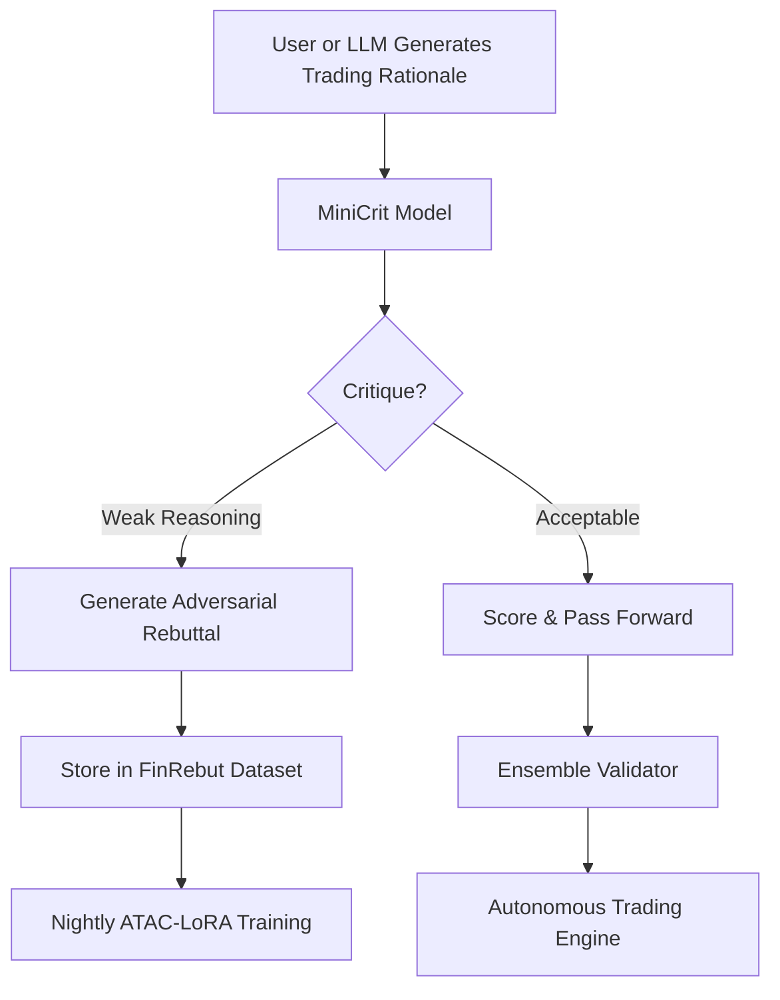

<p align="center">
  
</p>

# MiniCrit-1.5B  
### Adversarial Financial Critic Model for Autonomous LLM Trading Systems

[](https://doi.org/10.5281/zenodo.17594497)  
[](https://orcid.org/0009-0009-2503-2010)  
[](https://huggingface.co/datasets/wmaousley/finrebut-600)  
[](model-card/model-card.md)


## 🔥 Overview

**MiniCrit-1.5B** is an adversarial financial critic model designed to evaluate, rebut, and stress-test LLM-generated trading rationales.  
It functions as a *validator layer* inside multi-LLM autonomous trading engines.

This repository includes:

- **FinRebut-600** — 600 realistic rationales and adversarial rebuttals  
- **0.5B LoRA critic checkpoint** (CPU-trainable)  
- **Nightly ATAC-LoRA training pipeline**  
- **Research-ready notebooks and scripts**  
- **Zenodo DOI + ORCID integration** for publication and grant workflows


## 📚 Project Links

📦 **Repository:** https://github.com/wmaousley/MiniCrit-1.5B  
📊 **Dataset (FinRebut-600):** https://huggingface.co/datasets/wmaousley/finrebut-600  
📜 **Zenodo DOI:** https://doi.org/10.5281/zenodo.17594497  
🧑‍🔬 **ORCID Profile:** https://orcid.org/0009-0009-2503-2010  


## 🧠 Model Summary

- **Model Name:** MiniCrit-1.5B  
- **Type:** LoRA-extended adversarial financial critic  
- **Purpose:** Detect flawed reasoning, hallucinations, weak logic, and missing evidence in LLM-generated trading rationales  
- **Primary Role:** Acts as a *validator layer* inside a multi-LLM autonomous trading engine  
- **Training Pipeline:** ATAC-LoRA (nightly retraining supported)  
- **Dataset:** FinRebut-600 (600 rationale → rebuttal pairs)  
- **Hardware Target:** 8×A100-80GB (requested via Lambda Labs Research Grant)  
- **Included Artifacts:**  
  - CPU-trainable 0.5B LoRA critic checkpoint  
  - ATAC-LoRA training notebook and scripts  
  - Zenodo DOI + ORCID metadata for reproducibility  
- **Performance Highlights:**  
  - Forward paper-trading Sharpe improved from **+0.2 → +0.8**  
  - Significant reduction in hallucination-driven trade decisions  

```
## 📁 Repository Structure

MiniCrit-1.5B/
├── data/
│ └── finrebut-600.csv
├── notebooks/
│ └── ATAC_LoRA_MiniCrit.ipynb
├── checkpoints/
│ └── minicrit_lora_0.5b.pt
├── paper/
│ └── minicrit_preprint.pdf
└── src/
└── training/

```
## 🚀 Quickstart

```bash
pip install -r requirements.txt
python src/training/train_lora.py --dataset data/finrebut-600.csv
```

Or open the training notebook:

```
notebooks/ATAC_LoRA_MiniCrit.ipynb
```

## 📄 Citation

Ousley, W. A. (2025). *MiniCrit-1.5B: Adversarial Financial Critic Model and  
FinRebut-600 Dataset (v1.2.0)*. Zenodo.  
https://doi.org/10.5281/zenodo.17594497

```bibtex
@dataset{ousley2025minicrit,
  author    = {William A. Ousley},
  title     = {{MiniCrit-1.5B: Adversarial Financial Critic Model and FinRebut-600 Dataset}},
  year      = {2025},
  version   = {1.2.0},
  publisher = {Zenodo},
  doi       = {10.5281/zenodo.17594497},
  url       = {https://doi.org/10.5281/zenodo.17594497}
}
```

## 🏅 Author

**William Alexander Ousley**  
PMP • CSIE • CSAP  
AI/ML Researcher — Autonomous Trading Systems  
ORCID: https://orcid.org/0009-0009-2503-2010


## 🤝 Contributors

MiniCrit is an independent research project maintained by:

- **William Alexander Ousley** — Creator, lead researcher, dataset engineer, and model developer.

Contributions are welcome.  
If you would like to collaborate (datasets, pipeline upgrades, reproducibility fixes, or model improvements), please open an issue or submit a pull request.


## 💠 Funding & Acknowledgements

This project is part of an ongoing effort to build transparent, open-source adversarial evaluators for financial LLM systems.

Special acknowledgements:

- **Lambda Labs Research Grant (Pending Review)** — 2,000 A100-80GB compute hours requested  
- **CloudRift Research Grant (Under Review)** — 1,000 GPU hours requested  
- **HuggingFace** — Hosting the FinRebut-600 dataset  
- **Zenodo / CERN** — DOI archival and long-term preservation  
- **GitHub** — Repository infrastructure and distribution ecosystem  

This is an independent research project and is not affiliated with any institution, employer, or sponsor.


## 🧭 Project Roadmap (2025)

**Phase 1 — Dataset Expansion (Q4 2025)**  
- Expand FinRebut-600 → **FinRebut-2000**  
- Add macro-driven and high-volatility rationale categories  
- Introduce multi-rater adjudication (LLM + human)

**Phase 2 — Model Improvements**  
- Scale MiniCrit-1.5B → **MiniCrit-3B** (LoRA or QLoRA)  
- Add cross-model adversarial scoring (multi-LLM validation)  
- Integrate chain-of-thought flaw and hallucination detection  

**Phase 3 — Evaluation Framework**  
- Build a standalone **MiniCrit Evaluator API**  
- Create benchmark tasks for:  
  - fallacy detection  
  - weak reasoning detection  
  - hallucination classification  
  - adversarial rebuttal generation  

**Phase 4 — Research Publication**  
- Draft full 8–12 page technical report  
- Publish via Zenodo / TechRxiv  
- Add appendix covering datasets, methodology, and ablations


## 🔄 System Workflow



**ASCII Fallback (for GitHub mobile or Markdown viewers that don't support Mermaid):**

```
[ Rationale ] → [ MiniCrit ] → { Acceptable? }
       | Yes → Score → Validator → Trade Engine
       | No  → Rebuttal → Dataset → Nightly Training
```
